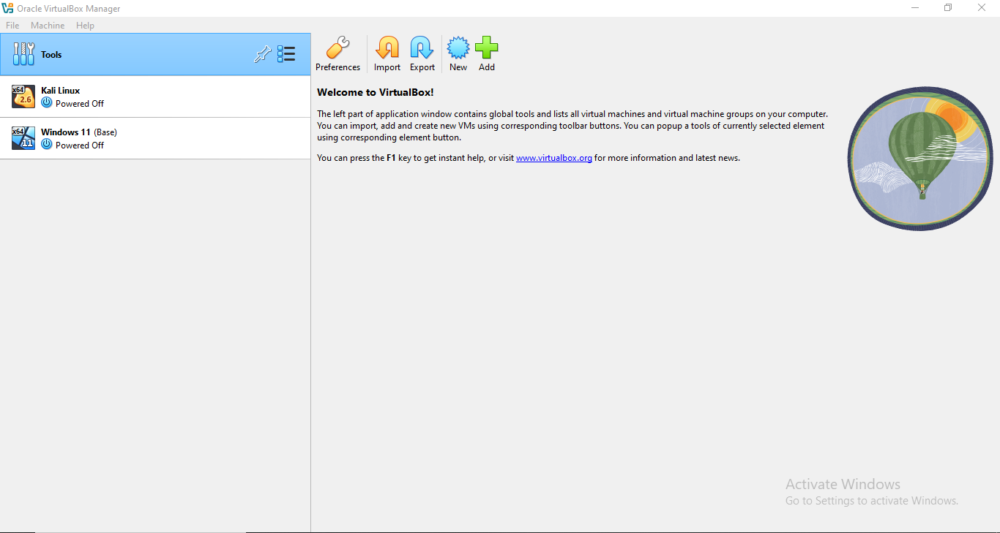
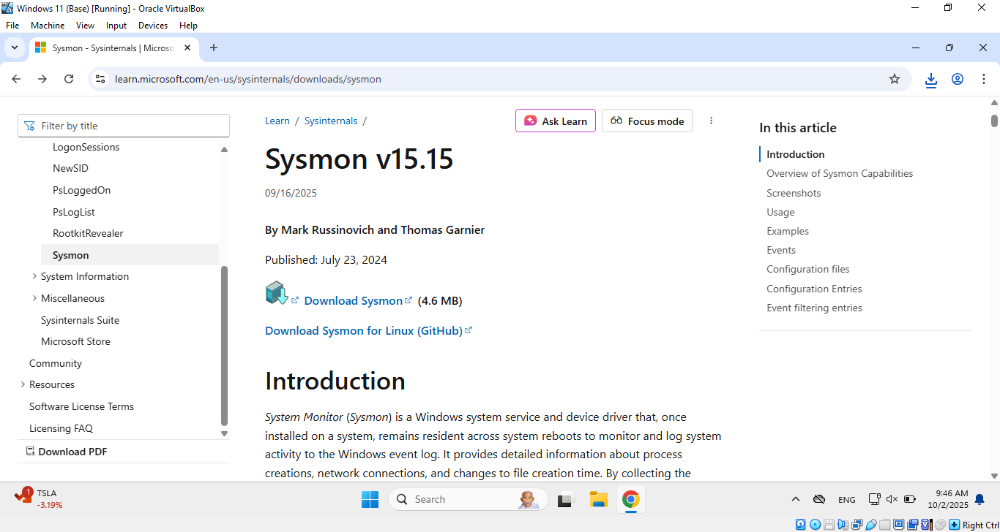
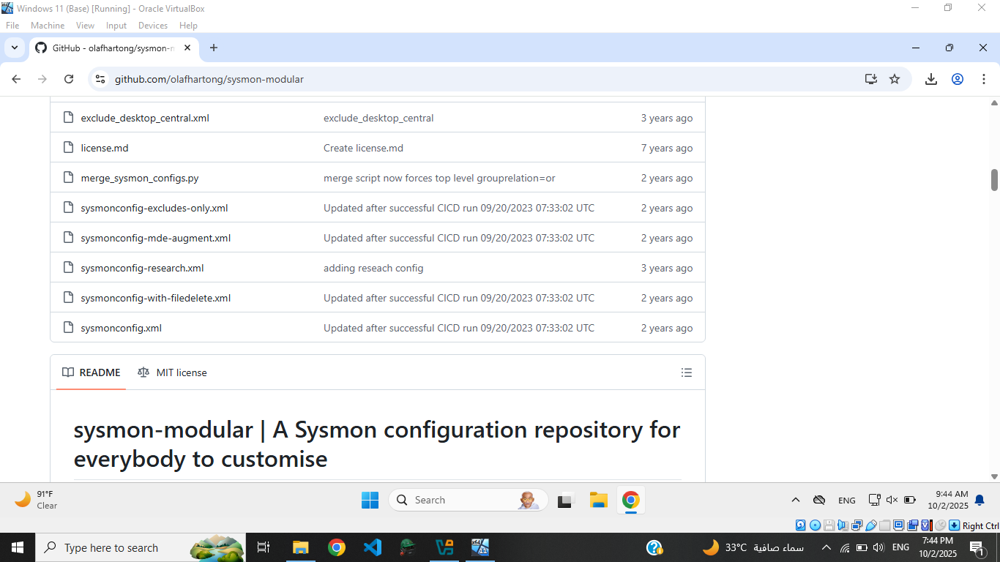
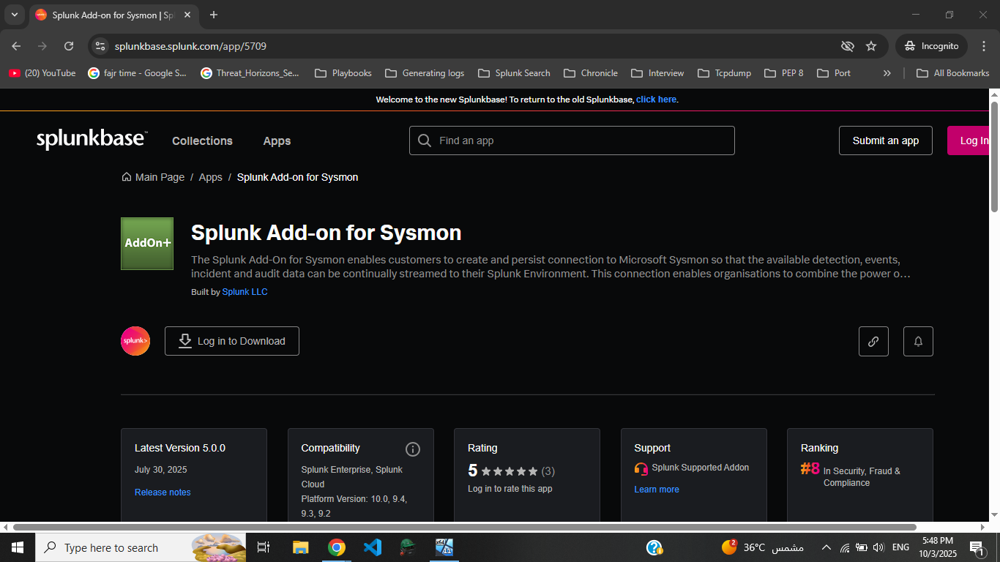
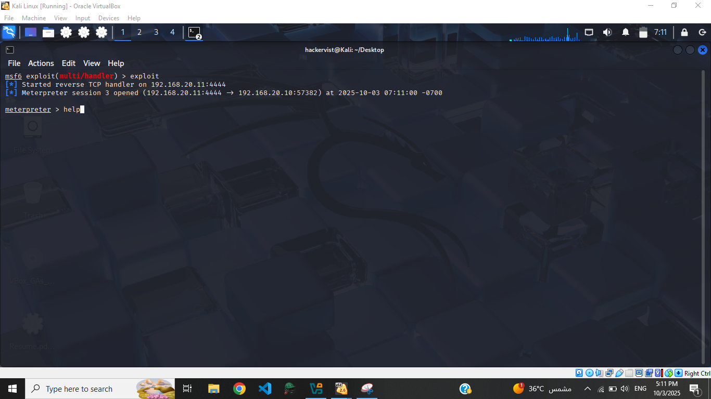
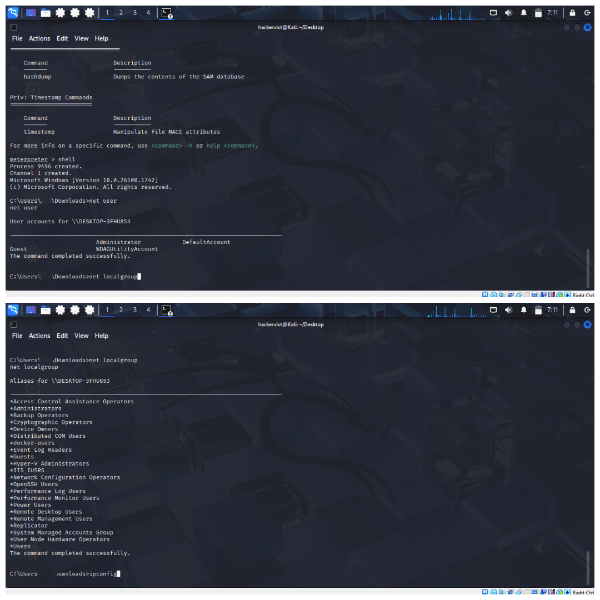
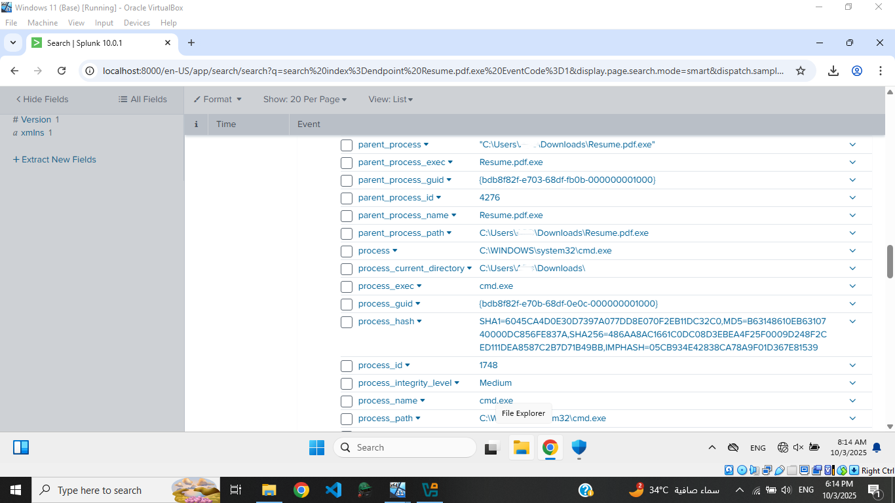
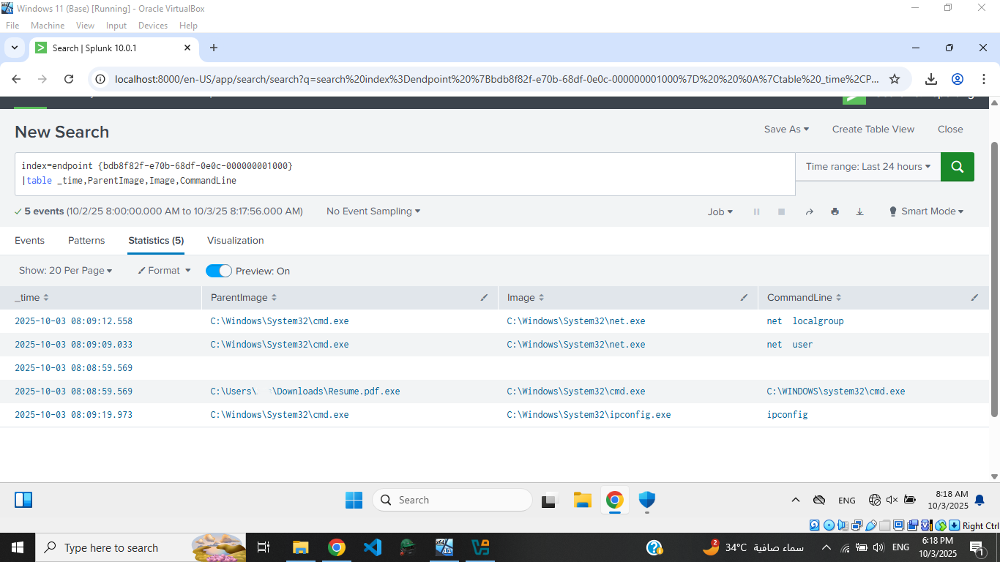

# SOC Home Lab — SIEM Detection (Splunk)

## Objective
Demonstrate an end-to-end SOC workflow in a controlled home lab: simulate a basic payload delivery and post-execution activity between an attacker VM and a Windows victim, collect Windows telemetry (Sysmon / event logs) into Splunk, and create searches/dashboards to detect and analyze the activity.

---

## Environment / Tools 
- **Windows VM (victim)** — Splunk (collector / instance) + Sysmon configured for detailed process creation and command-line telemetry.  
- **Kali Linux VM (attacker)** — used to simulate delivery and control of a payload (testing only).  
- **Splunk** — SIEM for ingesting, searching, and visualizing Windows telemetry.  
- **Sysmon** — Windows process creation / command-line visibility.  
- **msfvenom / Metasploit (msfconsole)** — used in the lab environment to generate/handle a test payload for simulation purposes only.  
- **Python simple HTTP server** — used to host the test payload in the isolated lab.

> Note: Offensive tools were used only to generate realistic telemetry for detection testing. This repository focuses on the defensive detection, analysis, and lessons learned. No exploit code or step-by-step offensive instructions are included.

---

## Lab flow
1. Prepare two isolated VMs: Kali (attacker) and Windows (victim with Sysmon + Splunk).  
2. Simulate payload transfer from attacker → victim (hosted via a simple HTTP server in the lab).  
3. Execute the simulated payload on the Windows host in the lab environment.  
4. Post-execution, collect process creation and command-line events (examples observed: `net user`, `net localgroup`, `ipconfig`) in Splunk.  
5. Use Splunk searches and dashboards to detect and build a timeline of the suspicious activity.

---

## What I observed / Evidence
- **Process creation events** captured the executed binary and full `CommandLine` arguments.  
- **Command-line artifacts** included enumeration commands that aligned with post-compromise behavior (`net user`, `net localgroup`, `ipconfig`).  
- **Correlation in Splunk** allowed pivoting from the initial download/new executable to subsequent suspicious commands and host context.

---

## Example defensive Splunk searches
Find suspicious enumeration commands:
```spl
index=endpoint {bdb8f82f-e70b-68df-0e0c-000000001000}
| search CommandLine="*net user*" OR CommandLine="*net localgroup*" OR CommandLine="*ipconfig*"
| table _time,ParentImage,Image,CommandLine
```
## 🖼️ Screenshots

Below are selected screenshots highlighting each stage of the lab setup, attack simulation, and log detection process.

---

### 1️⃣ Lab Environment Setup
<p align="center">
  
</p>
<p align="center"><em>Figure 1: VirtualBox lab setup with two virtual machines — Kali Linux (attacker) and Windows 10 (victim).</em></p>

---

### 2️⃣ Sysmon Installation
<p align="center">
  
</p>
<p align="center"><em>Figure 2: Sysmon official download page used to install the tool on the Windows victim machine.</em></p>

---

### 3️⃣ Sysmon Configuration
<p align="center">
  
</p>
<p align="center"><em>Figure 3: Sysmon configuration file obtained from GitHub to generate detailed process and network telemetry.</em></p>

---

### 4️⃣ Sysmon Integration with Splunk
<p align="center">
  
</p>
<p align="center"><em>Figure 4: Sysmon logs successfully integrated into Splunk via the Sysmon TA add-on.</em></p>

---

### 5️⃣ Attack Simulation via Metasploit
<p align="center">
  
</p>
<p align="center"><em>Figure 5: Metasploit multi-handler listening for incoming connections after payload creation and delivery.</em></p>

---

### 6️⃣ Attacker Shell and Enumeration
<p align="center">
  
</p>
<p align="center"><em>Figure 6: Meterpreter shell session on the Kali attacker machine executing enumeration commands (ipconfig, net user, net localgroup).</em></p>

---

### 7️⃣ Process Creation and Command-Line Evidence
<p align="center">
  
</p>
<p align="center"><em>Figure 7: Sysmon process creation events capturing executed commands from the compromised host.</em></p>

---

### 8️⃣ SIEM Detection and Query
<p align="center">
  
</p>
<p align="center"><em>Figure 8: Splunk query showing detection of payload execution and associated command-line activity.</em></p>
